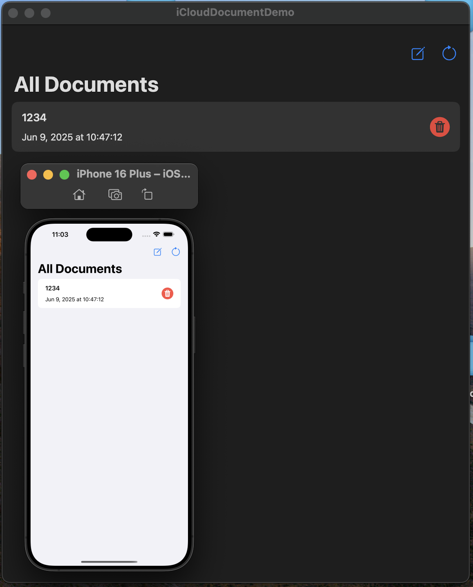
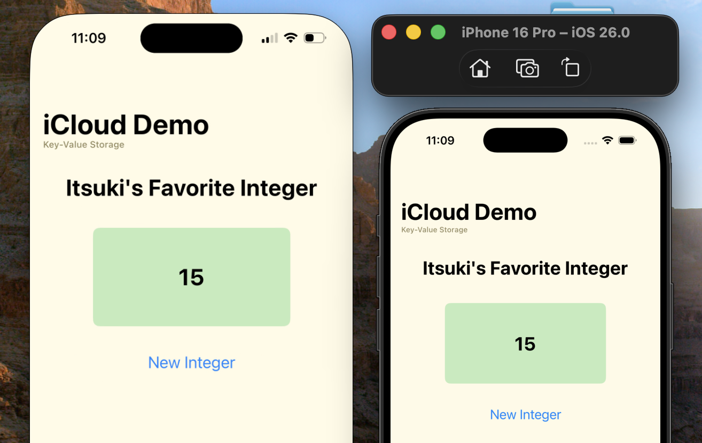

#  iCloud/CloudKit Demo

This repository includes the following demo.
- [Content Collaboration with CloudKit](#content-collaboration)
- [Synchronous Swift Data Automatically with ModelContainer](#sync-swift-data-automatic)
- [Sync Files](#sync-files)
- [Sync Key-value pairs](#sync-key-value)


## Content Collaboration
A Simple content collaboration app where multiple users will be able collaborating on some simple notes (a title, a content).

Specifically, this demo includes the following.
- Create custom CKRecordZone for storing the records
- Create a CKRecord for the data we want to share, ie: A title and a content that the user will be editing on.
- Create a CKShare for the record when we decide to share it. Or retrieve it if already exists.
- Share our content with other users using a combination of ShareLink, SWCollaborationView, and UICloudSharingController.
- Listen to Local changes on CKShare made by user using the system UIs, for example, the share sheet. So that we can update our variables and UIs based on it.
- Accept the share.
- Listen for remote changes on the CKRecord we are editing so that we can update its content (almost) synchronously! Using CKDatabaseSubscription and CKQuerySubscription.

### Set up
In addition to the set up specified in the [Common Configuration](#common-configuration), update the `containerIdentifier` variable of the `CloudManager` to the one you will be using
```
private static let containerIdentifier: String = "iCloud.your.identifier"
```


To test it, run the app on couple real devices signed into different iCloud account.
- Notifications for subscriptions are not received correctly on simulators.


For more details, please refer to my blog: [SwiftUI: Content Collaboration with iCloud](https://medium.com/@itsuki.enjoy/swiftui-a-simple-simultaneous-content-collaboration-app-with-icloud-b50802aa4007)


## Sync Swift Data (Automatic)
A simple app supporting Synchronizing Swift Data Model with ModelContainer.
- ModelContainer provides a fully managed schema, maintains a local replica of the data, and supports the public, private, and shared databases without any additional set up or direct interaction with CloudKit containers and databases
- We don't have control over how and when our data syncs


To set up the demo, please refer to the [Common Configuration](#common-configuration) section.

To test it, run the app on multiple simulators that are signed into the same iCloud account. 


For more details, please refer to my blog: [SwiftData: Synchronize Model Data with iCloud (Automatic)](https://medium.com/@itsuki.enjoy/swiftdata-synchronize-model-data-with-icloud-automatic-with-modelcontainer-e37bce84024c)


## Sync Files 
A simple app that synchronize files (text documents) using iCloud Document.

Specifically, it uses `NSMetadataQuery` to discover documents stored in an iCloud Container and watch for changes.

To set up the demo, please refer to the [Common Configuration](#common-configuration) section.

To test it, run the app on multiple devices (preferably real devices instead of simulators) that are signed into the same iCloud account. 

For more details, please refer to my blog: [SwiftUI: Synchronize/Store Files (Documents) with iCloud]()




## Sync Key-Value 
A simple app that synchronize key-value pairs such as user's preference using iCloud key-value storage.

To set up the demo, please refer to the [Common Configuration](#common-configuration) section.

To test it, run the app on multiple devices (preferably real devices instead of simulators) that are signed into the same iCloud account. 

For more details, please refer to my blog: [SwiftUI: Sync User Preferences with iCloud Key-Value Storage]()




## Common Configuration

Before running the demo, perform the following steps.
- In the General pane, select the target interested, update the Bundle Identifier field with a new identifier.
- select the applicable team from the Team drop-down menu
- Make sure the iCloud capability is present and the CloudKit option is in a selected state.
- For content collaboration or swift data syncing, select an existing iCloud container or create a new one.
